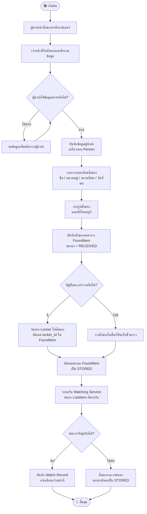
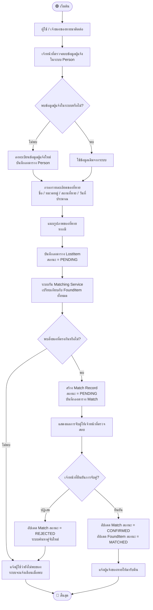
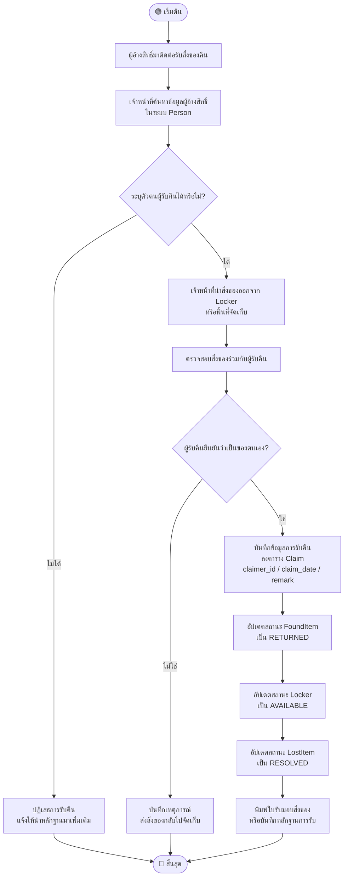
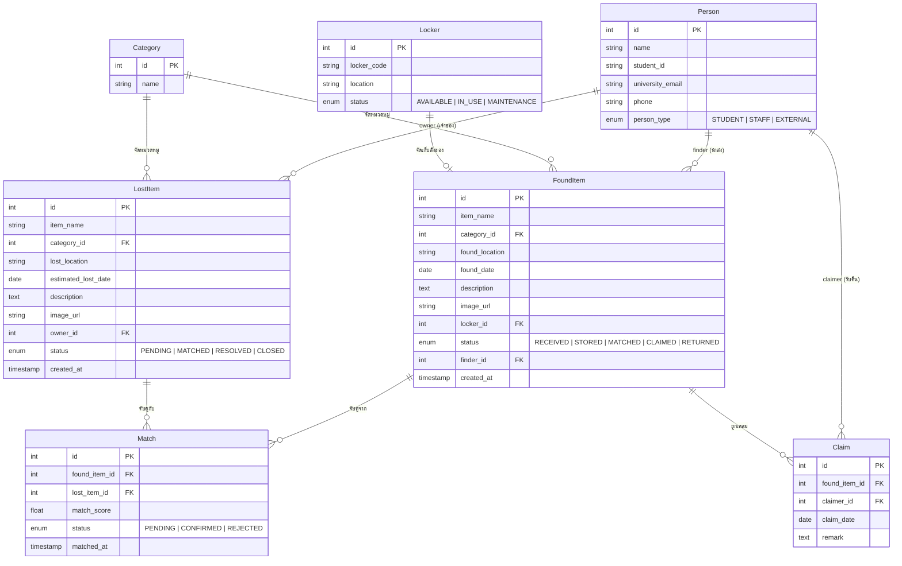
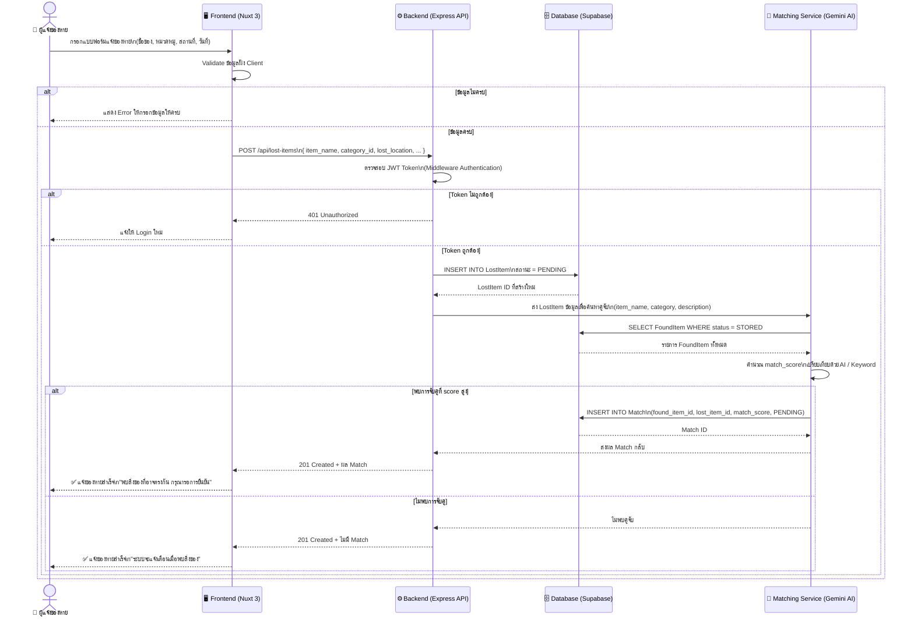
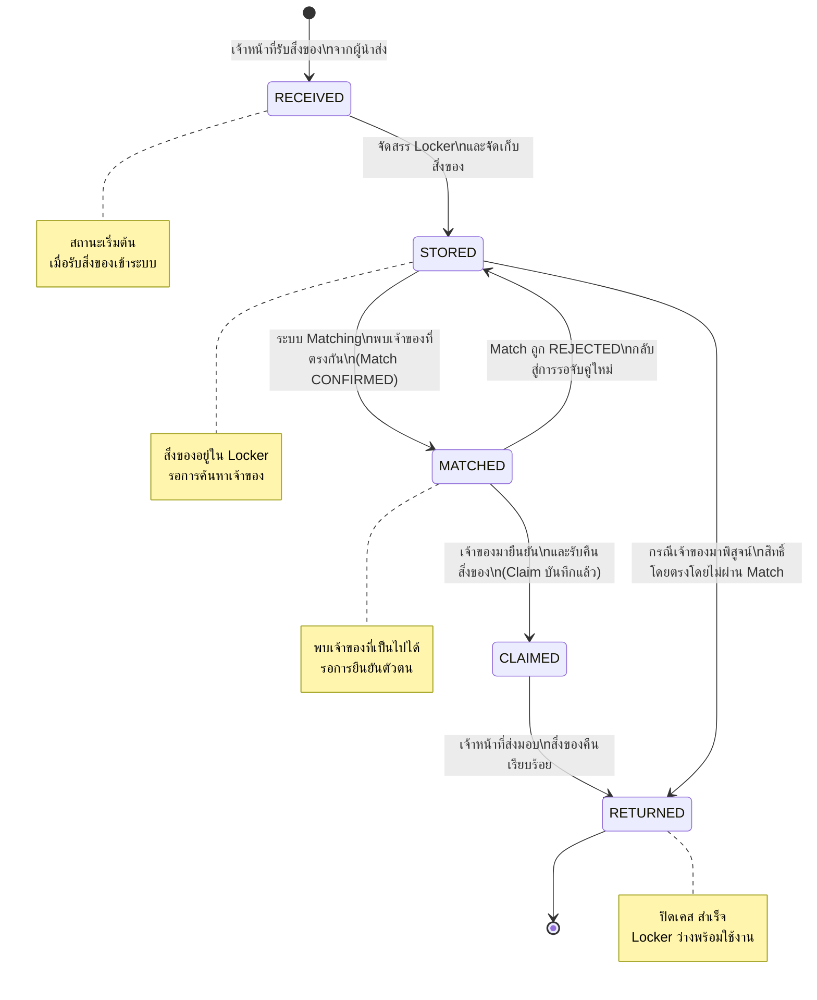
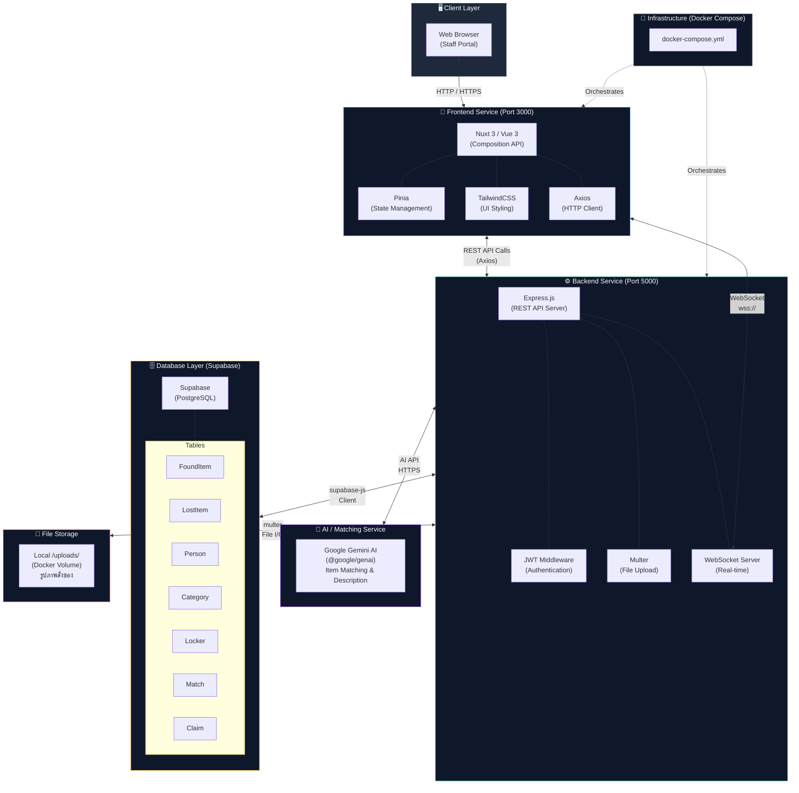

# 📊 UniFind — System Diagrams

ไฟล์รวม Diagram ทั้งหมดของระบบ UniFind (Lost & Found System) สำหรับมหาวิทยาลัยหอการค้าไทย (UTCC)

---

## 1. Activity Diagrams

### Flow 1: รับของที่มีคนนำมาส่ง (Receive Found Item)

---

### Flow 2: แจ้งของหาย (Report Lost Item)

---

### Flow 3: รับคืนสิ่งของ (Claim / Return Item)

---

## 2. ER Diagram (Entity Relationship Diagram)

---

## 3. Sequence Diagram: การแจ้งของหาย (Report Lost Item)

---

## 4. State Diagram: สถานะของ "ของที่พบ" (FoundItem Status)

---

## 5. System Architecture Diagram

---

## 📌 สรุป Status ทั้งหมดในระบบ

| Entity | Status ที่เป็นไปได้ |
|---|---|
| **FoundItem** | `RECEIVED` → `STORED` → `MATCHED` → `CLAIMED` → `RETURNED` |
| **LostItem** | `PENDING` → `MATCHED` → `RESOLVED` / `CLOSED` |
| **Match** | `PENDING` → `CONFIRMED` / `REJECTED` |
| **Locker** | `AVAILABLE` → `IN_USE` → `AVAILABLE` |

---

*เอกสารนี้สร้างโดย AI Assistant สำหรับโปรเจกต์ UniFind — UTCC*
