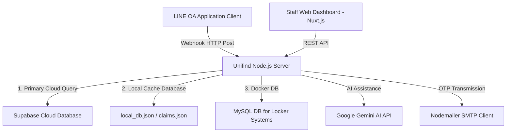
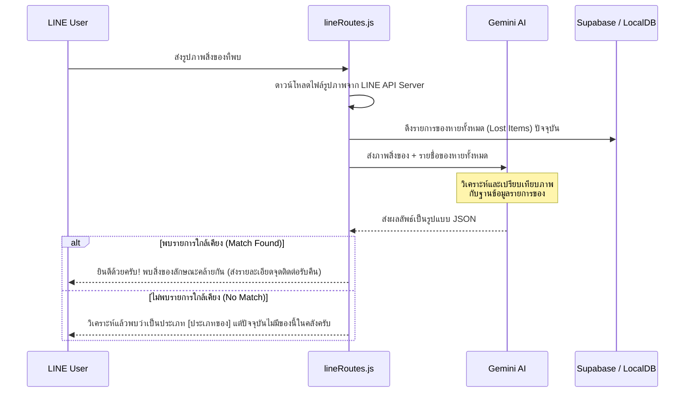
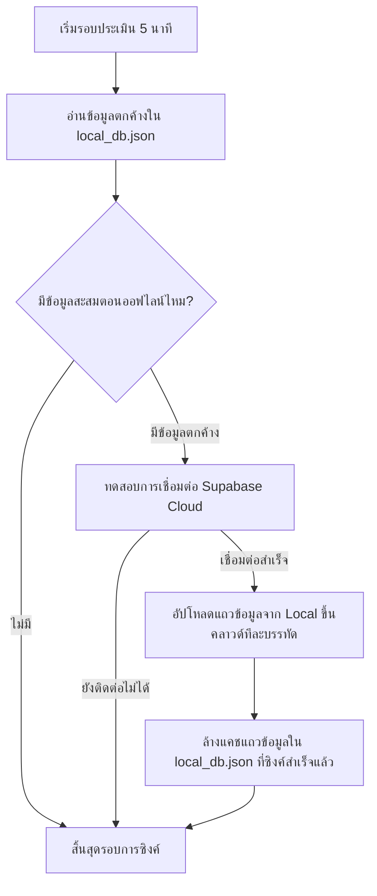

# 📋 รายงานสรุป Logic การทำงานของระบบ Unifind Backend

เอกสารนี้รวบรวมและวิเคราะห์สถาปัตยกรรมทางตรรกะ (Logic Diagram & Logic Description) ทั้งหมดของซอฟต์แวร์ฝั่งหลังบ้าน (Backend) ของระบบตามหาของหาย Unifind เพื่อใช้เป็นเอกสารอ้างอิงสำหรับการเรียนรู้และเตรียมตัวตอบคำถามในการนำเสนอ

---

## 🗺️ 1. ภาพรวมสถาปัตยกรรมระบบ (System Architecture Overview)

ระบบทำงานในรูปแบบ **Hybrid Stack** ที่รองรับกรณีเซิร์ฟเวอร์ออฟไลน์ (Offline-First Design) โดยมีฐานข้อมูล 2 ส่วนหลักทำงานร่วมกัน:



* **เซิร์ฟเวอร์หลัก**: พัฒนาขึ้นด้วย Node.js (Express Framework) รันอยู่บนพอร์ต `9001` ภายใน Docker Container `unifind_backend`
* **ระบบความปลอดภัยของ Webhook**: การเชื่อมโยงข้อมูลจากแอปพลิเคชันภายนอกไปยังเซิร์ฟเวอร์ จะต้องผ่านการเข้ารหัสเพื่อตรวจสอบ Signature (`x-line-signature`) ทุกครั้งเพื่อป้องกันการปลอมแปลงพาสสัญญาณ

---

## 🕸️ 2. ตรรกะการคัดแยกประเภทความตั้งใจของผู้ใช้ (Hybrid AI NLP & Message Router)

จุดรับทราฟฟิกหลักจาก LINE API คือ **`backend/src/routes/lineRoutes.js`** เมื่อมีผู้ใช้ส่งข้อความเข้ามา ระบบจะดำเนินการตามตรรกะการทำงาน (Logic Flow) ดังนี้:

### A. เมื่อผู้ใช้ส่งข้อความรูปภาพ (Image Processing Logic)


### B. เมื่อผู้ใช้ส่งข้อความตัวอักษร (Text Processing Logic)
เมื่อได้รับข้อความตัวอักษร ระบบจะส่งข้อความไปหา **Gemini AI API** เพื่อทำ **Intent Classification** (คัดแยกความต้องการของผู้ใช้) ออกเป็น 4 เคส:

```javascript
// ตัวอย่าง Prompt การคัดกรองเจตจำนงของผู้ใช้
const classificationPrompt = `วิเคราะห์ประโยคของผู้ใช้ภาษาไทยต่อไปนี้ว่ามีจุดประสงค์อะไร...
1. "SUMMARY" - ถามสถิติภาพรวม เช่น มีของอะไรตกหล่นบ้าง
2. "SEARCH" - ต้องการตามหาหรือตรวจสอบสิ่งของเฉพาะเจาะจง
3. "REPORT_LOST" - ประสงค์แจ้งทำของหายชิ้นใหม่เข้าระบบ
4. "CHITCHAT" - คุยทักทายทั่วไป บ่น หรือพิมพ์ประโยคเกริ่นนำกว้างๆ`;
```

เมื่อวิเคราะห์ผลลัพธ์จาก AI แล้ว ระบบจะเรียกใช้ฟังก์ชันย่อยตามแต่ละเจตจำนง:
1. **`SUMMARY`**: ดึงหมวดหมู่สิ่งของคงค้างทั้งหมดขึ้นมาสรุปรายงานแยกประเภทเป็นจำนวนชิ้นให้ทราบในแชทเดียว
2. **`SEARCH`**: ส่งข้อมูลเข้า **`handleSearchIntent`** เพื่อสกัด Keyword (ชื่อของ) และ Place (สถานที่) ออกมาใช้คิวรี่ Supabase ผ่านคำสั่ง Logical `.or()` 
3. **`REPORT_LOST`**: ตรวจสอบการผูกบัญชีก่อน หากผ่านสิทธิ์แล้วจะนำข้อมูลเข้าฟังก์ชันจำแนกความละเอียดสิ่งของ ถ้าละเอียดพอจะทำการบันทึกข้อมูลเข้าระบบทันที
4. **`CHITCHAT`**: คุยตอบรับทั่วไปอย่างเป็นมิตรด้วย Gemini AI โดยรักษาน้ำเสียงที่เป็นกันเองเพื่อตอบคำถามทั่วไป

---

## 🔒 3. ระบบยืนยันตัวตนและการผูกบัญชี (Account Binding & OTP Logic)

เพื่อให้ระบบจำกัดสิทธิ์เฉพาะบุคลากรภายในมหาวิทยาลัยหอการค้าไทย (UTCC) ระบบจึงใช้ตรรกะแบบสองปัจจัยในการบันทึกตัวตนผู้ใช้:

```mermaid
autonumber
User->>LINE Bot: พิมพ์อีเมลมหาวิทยาลัย (เช่น 221051110xxxx@live4.utcc.ac.th)
LINE Bot->>OTP Store: สร้างรหัสสุ่ม OTP 6 หลัก และเก็บไว้ในหน่วยความจำชั่วคราว (อายุ 5 นาที)
LINE Bot->>SMTP Server: เรียกใช้ Nodemailer ส่งอีเมลออกไปยังอีเมลปลายทางของผู้ใช้
SMTP Server-->>User: ได้รับจดหมายแจ้งรหัส OTP
User->>LINE Bot: พิมพ์รหัส 6 หลักตอบกลับในแชท
LINE Bot->>OTP Store: ตรวจสอบความถูกต้องของรหัส
alt รหัสตรงกันและไม่หมดอายุ
    LINE Bot->>Supabase: บันทึกข้อมูลผูก ID LINE คู่กับ Person Record (persons)
    LINE Bot-->>User: แสดงการตอบกลับ "ผูกบัญชีสำเร็จ 🎉" (ส่ง Flex Message)
else รหัสไม่ถูกต้อง / หมดอายุ
    LINE Bot-->>User: แจ้งข้อผิดพลาด ปฏิเสธรายการผูกบัญชี
end
```

---

## 🔄 4. ระบบการซิงค์ฐานข้อมูลกรณีเซิร์ฟเวอร์ออฟไลน์ (Offline-First Sync Logic)

เพื่อให้ระบบสามารถทำงานได้ต่อเนื่องแม้ Supabase หรืออินเทอร์เน็ตภายนอกจะหยุดทำงานชั่วคราว ระบบ Unifind ได้รับการพัฒนาตรรกะระบบแคชท้องถิ่นไว้ดังนี้:

### A. การเรียกดูและบันทึกข้อมูล (Write/Read Operation)
* เมื่อเซิร์ฟเวอร์ยิงคิวรี่ไปยัง Supabase แล้วพบข้อผิดพลาดหรือหมดเวลา (Network Timeout) -> ระบบจะสลับไปอ่านและเขียนบันทึกลงในไฟล์โลคอล **`uploads/local_db.json`** ทันที เพื่อไม่ให้ API ขัดข้อง
* ในส่วนของคำร้องขอคืนของ จะเก็บบันทึกสำรองไว้ในไฟล์ **`uploads/claims.json`** 

### B. วงรอบการซิงค์กลับขึ้นระบบคลาวด์ (Incremental Synchronize Cron Job)
สคริปต์ **`backend/src/utils/dbSync.js`** จะถูกรันทำงานในรูปแบบ background task ทุก ๆ 5 นาที:



---

## 🤖 5. ตรรกะระบบการจับคู่สิ่งของหายอัจฉริยะ (AI Matching & Notification Engine)

บริการ **`backend/src/services/matchingService.js`** จะทำงานอัตโนมัติทุกครั้งเมื่อมีการบันทึกสิ่งของที่พบชิ้นใหม่เข้าคลัง:

1. **ดึงประวัติรายงานของหาย**: ค้นหาข้อมูลจากตาราง `lost_items` ที่มีสถานะยังตามหาอยู่ (`status = 'searching'`)
2. **จับคู่ด้วยข้อมูลเบื้องต้น**: คัดกรองสิ่งของหายที่มีหมวดหมู่และสถานที่ประเภทเดียวกัน
3. **ส่งให้ Gemini AI ตรวจสอบความถูกต้องระดับลึก**: ส่งรายละเอียดทั้งชื่อ สี และลักษณะเด่นของชิ้นที่พบ กับชิ้นที่ทำหาย ไปให้ AI วิเคราะห์ตัดสินความคล้ายคลึง
4. **ส่งแจ้งเตือนด่วน**: หากวิเคราะห์แล้วพบว่ามีความตรงกันมากกว่า 80% ระบบจะจับคู่ `lineBindings` เพื่อระบุ ID ผู้ใช้ LINE ของผู้ที่ทำหาย และทำการยิงข้อความ **LINE Push Notification** แจ้งเตือนส่วนตัวทันทีว่า *"น้องบอทพบของที่คล้ายกับของของคุณในคลังแล้วนะครับ"*
